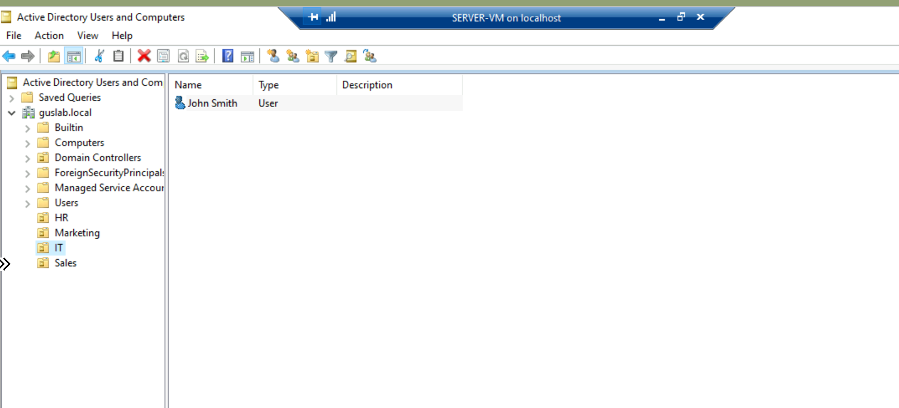

# Active Directory Home Lab

## Overview
Built a Windows Server domain environment to practice user management, group policies, and common Help Desk tasks.

## Environment
- **Domain Controller:** Windows Server 2022
- **Client Machine:** Windows 10/11 Pro
- **Virtualization:** VirtualBox / VMware

## Tasks Completed

### User Management
- Created organizational units (OUs) for departments
- Added user accounts and assigned to security groups
- Performed password resets and account unlocks

### Group Policy
- Configured password policies
- Deployed mapped network drives
- Set desktop wallpaper via GPO

### Troubleshooting
- Resolved account lockouts
- Fixed domain join issues
- Diagnosed replication problems

## Screenshots & Walkthroughs

### Infrastructure Setup

**Renamed Server and configured a static IP**

(../screenshots/change-server-name.png)
(../screenshots/change-server-name-dc01.png)
**Installing Active Directory Domain Services**

Installed the AD DS role through Server Manager and promoted the server to a Domain Controller for the `lab.local` forest.

---

**Promoting Server to Domain Controller**

Clicked the notification flag in Server Manager and promoted the server to a Domain Controller, creating a new forest.

---

**Organizational Units Structure**

Created OUs for IT, HR, and Marketing to organize users and apply targeted Group Policies.

---

### User Management

**Creating a New User in ADUC**

Created user accounts and assigned them to appropriate OUs—a daily Help Desk task for onboarding.

---

### Group Policy

**Account Lockout Policy**

Configured account lockout thresholds to protect against brute-force attacks while minimizing unnecessary lockouts for users.

---

### Troubleshooting (Real Problems I Solved)

#### Problem 1: Client VM Couldn't Communicate with Domain Controller

**The Issue:** Left DHCP enabled on the client VM, which assigned it to a different subnet than the DC. The machines couldn't see each other.

**Before (Auto DHCP):**

**The Fix:** Configured a static IP on the client and pointed the DNS server to the DC's IP address (192.168.1.10).

**Lesson Learned:** Always verify network settings before attempting domain joins. DNS must point to the DC.

---

#### Problem 2: Couldn't Remember DC Admin Credentials During Domain Join

**The Issue:** When prompted for credentials to join the domain, I couldn't recall the exact admin username format.

**What I Did:**
1. Logged back into the DC
2. Opened ADUC to verify the administrator account
3. Returned to client and successfully joined using `lab.local\Administrator`

**First Login Attempt After Join:**

**Password Change on First Login:**

**Lesson Learned:** Document credentials securely. In production, use a password manager or privileged access management (PAM) solution.

## What I Learned
- How Active Directory structures users and resources
- Real-world Help Desk tasks like password resets and account management
- Group Policy fundamentals for managing multiple machines
