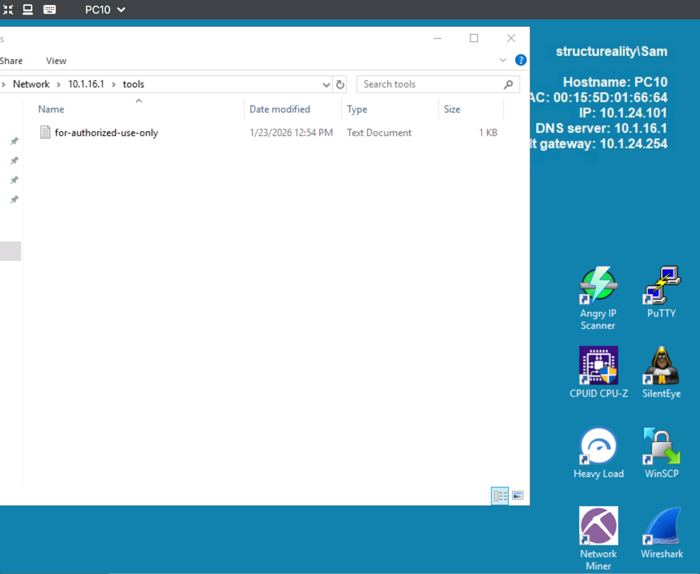
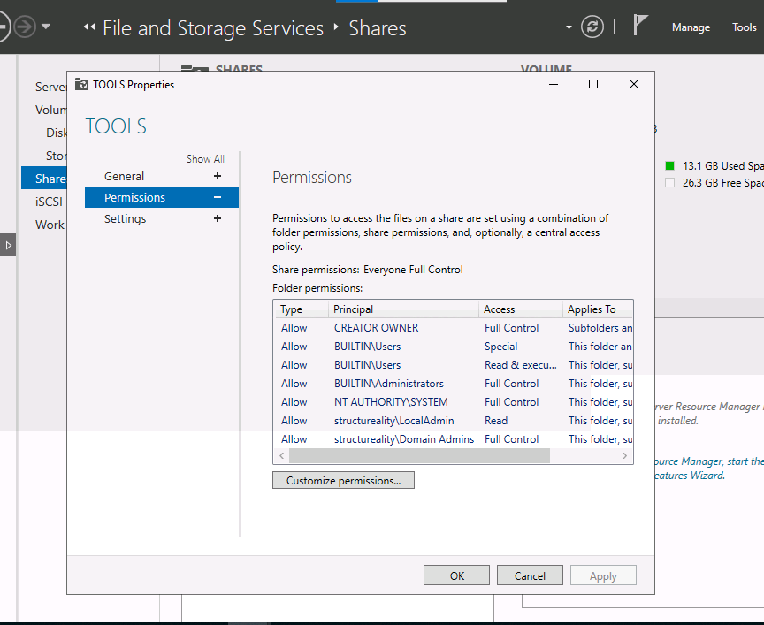
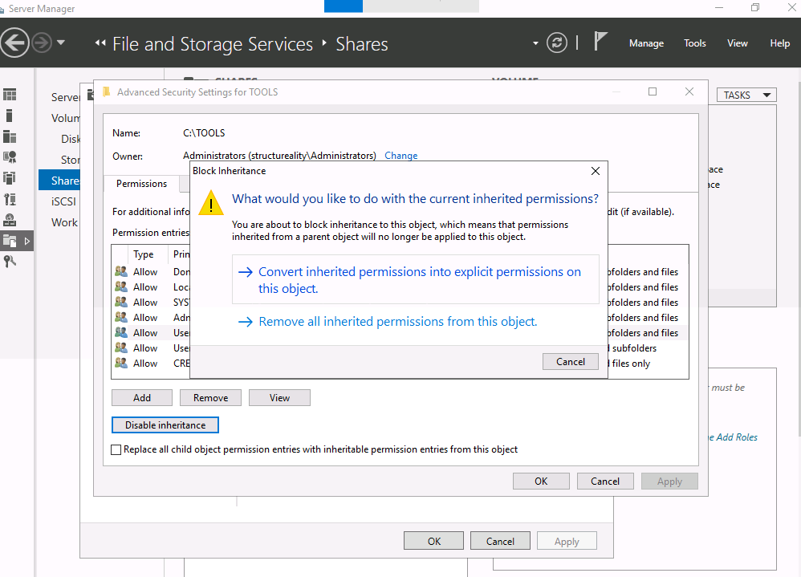
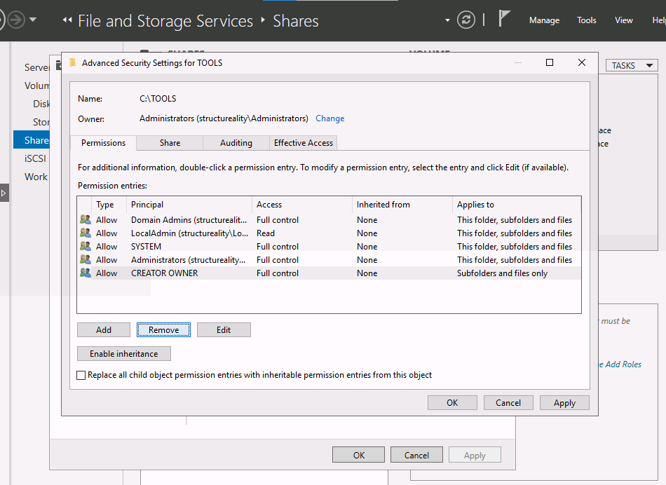
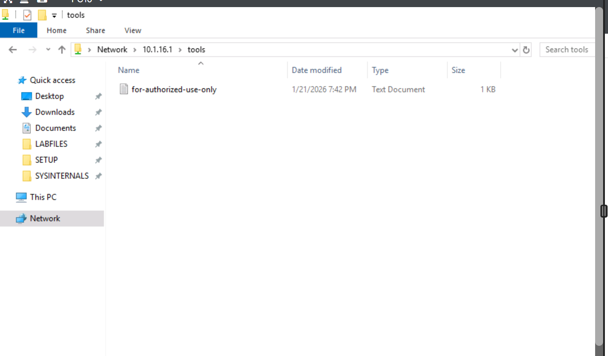
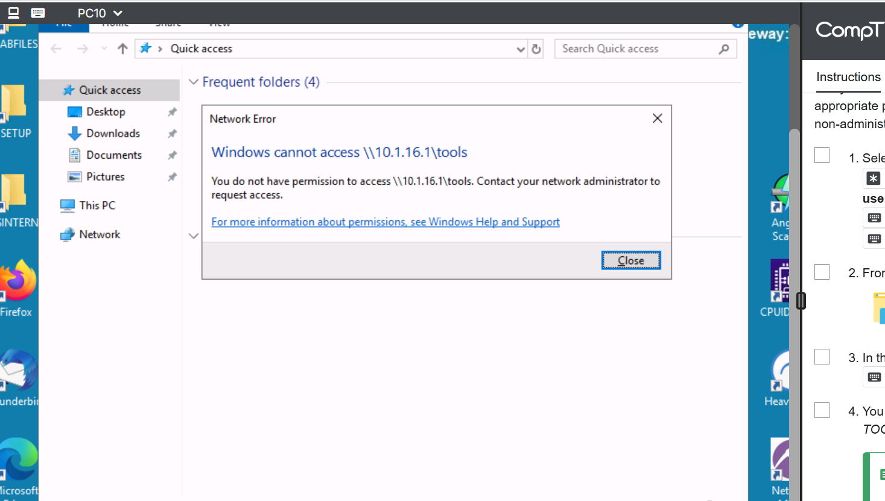

# Security Controls Lab | Completed January 2026

## Overview

Configured and tested four types of security controls (preventive, detective, directive, corrective) in a Windows Server environment. This lab demonstrates practical implementation of access controls aligned with Security+ exam objectives.

**Environment:** Windows Server 2022 (DC10) with domain-joined Windows 10 client (PC10)  
**Domain:** ad.structureality.com

---

## Preventive Controls

**Objective:** Restrict access to the TOOLS share so only administrators can access sensitive utilities and data files.

### Scenario

The C:\TOOLS folder on DC10 contains administrative utilities that should only be accessible to Domain Admins and local Administrators. Standard users were able to access this share—a security weakness that needed remediation.

### Initial State (Before)

Sam, a non-admin account, has access to a share she shouldn't have access to

The TOOLS share had overly permissive NTFS permissions inherited from the parent:

| Principal | Access | Inherited |
|-----------|--------|-----------|
| Domain Admins | Full Control | None |
| LocalAdmin | Read | None |
| SYSTEM | Full Control | None |
| Administrators | Full Control | None |
| **Users** | **Read & Execute** | **None** |
| Users | Special | None |
| CREATOR OWNER | Full Control | None |

**Problem:** The Users group had Read & Execute permissions, allowing any authenticated user to access administrative tools.

### Remediation Steps

**1. Access Advanced Security Settings**
- Server Manager → File and Storage Services → Shares
- Right-click TOOLS share → Properties → Permissions → Customize permissions

**2. Disable Inheritance**
- Click "Disable inheritance"
- Select "Convert inherited permissions into explicit permissions on this object"
- This preserves existing permissions while allowing modification

**3. Remove Users Group**
- Select Users (structureality\Users) entries
- Click Remove for each Users entry
- Apply changes

### Final State (After)

| Principal | Access | Inherited |
|-----------|--------|-----------|
| Domain Admins | Full Control | None |
| LocalAdmin | Read | None |
| SYSTEM | Full Control | None |
| Administrators | Full Control | None |
| CREATOR OWNER | Full Control | None |

**Share Permissions:** Everyone - Full Control (NTFS permissions provide the restriction)

### Verification

**Test 1 - Before remediation (from PC10 as standard user):**
- Accessed `\\10.1.16.1\tools` successfully
- Could open "for-authorized-use-only" file

**Test 2 - After remediation (from PC10 as standard user):**
- Attempted to access `\\10.1.16.1\tools`
- Received "Windows cannot access \\10.1.16.1\tools - You do not have permission to access"

### Security+ Concepts Demonstrated

- **Preventive Control:** Stops unauthorized access before it occurs
- **Principle of Least Privilege:** Users only get permissions required for their role
- **DAC (Discretionary Access Control):** Owner controls access via NTFS permissions
- **Defense in Depth:** NTFS permissions layer on top of share permissions

### Key Takeaways

1. **Share vs. NTFS Permissions:** Share permissions set "Everyone: Full Control" as a pass-through; NTFS permissions handle the actual restriction. The most restrictive permission wins.

2. **Inheritance Blocking:** Converting to explicit permissions (vs. removing all) preserves the existing security structure while allowing granular modifications.

3. **Verification is Critical:** Always test from an actual non-admin account to confirm the control works as intended.

---

## Detective Controls

*Coming soon*

---

## Directive Controls

*Coming soon*

---

## Corrective Controls

*Coming soon*

---

## Lab Environment

| Machine | Role | IP Address |
|---------|------|------------|
| DC10 | Domain Controller / File Server | 10.1.16.1 |
| PC10 | Domain-joined Windows 10 Client | DHCP |

## References

- CompTIA Security+ SY0-701 Exam Objectives
- [Microsoft Docs: NTFS Permissions](https://docs.microsoft.com/en-us/windows-server/storage/file-server/ntfs-overview)
