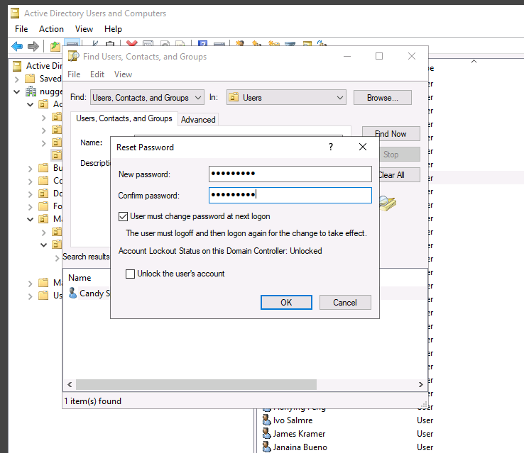
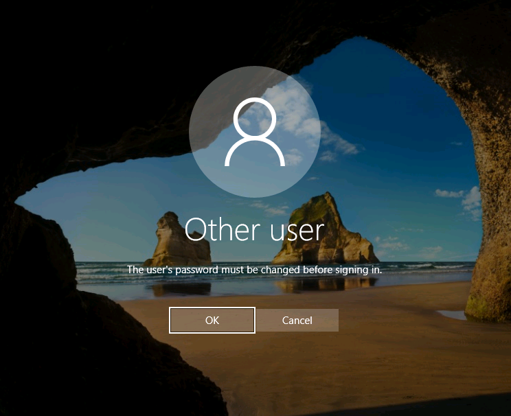
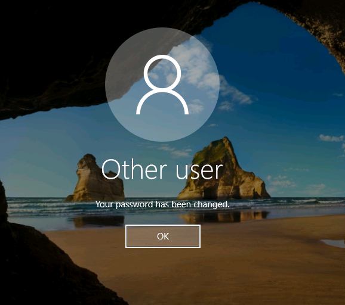
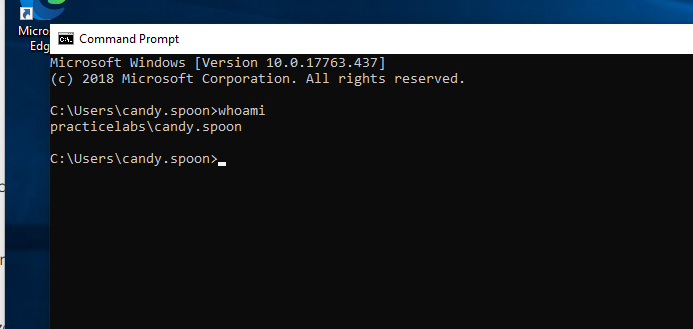
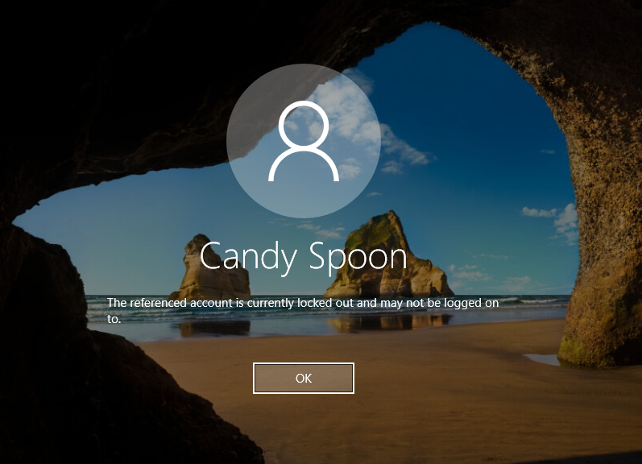
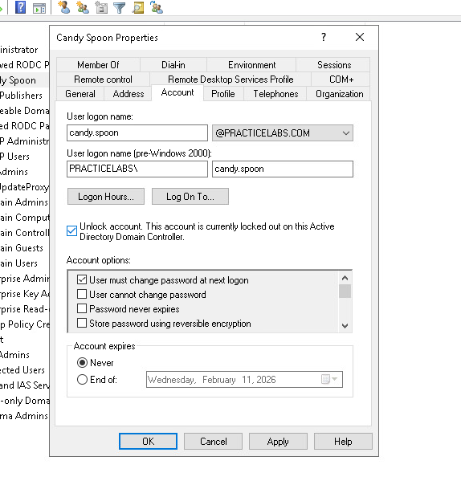

# Troubleshooting

# Help Desk Ticket Scenario #001: User calls in saying they can't log in and need to reset their password

**Password Reset**

Found the correct user on ADUC and made sure they had to change their PW at next logon for security purposes.





**Confirmed Client Could Log In**

Made sure the user could successfully log in after the password reset.





**ALWAYS make sure the user can log in. NEVER close the ticket and move on unless you want extra work and duplicate tickets**



I only show this to prove she logged in. In a real-world scenario, I'd be confirming with the user over the phone.


# Help Desk Ticket Scenario #002: User Locked Out
**User:** Candy Spoon (APAC Department)
**Issue:** "I can't log in — it says my account is locked"
**Priority:** Medium
**Time to Resolution:** 4 minutes

**Method 1: GUI (Active Directory Users & Computers)**

Find the CORRECT user on Active Directory's ADUC and tick the unlock account.





Make sure to ask if she needs the password reset or if she notices whether the CAPS LOCK was ON or she was typing the password incorrectly before ending the call.

## Method 2: PowerShell (Faster for experienced techs)

---

### Step 1: Verify the Lockout

Ran PowerShell on the Domain Controller to check account status:

**Troubleshooting**: Ran into "Cannot find an object with identity:" error and had to confirm the user's correct username


```powershell
Get-ADUser -Identity candy.spoon -Properties LockedOut, BadLogonCount
```

**Result:**
| Property | Value |
|----------|-------|
| LockedOut | True |
| BadLogonCount | 5 |


The account was locked after 5 failed password attempts, which matches our Account Lockout Policy GPO (threshold: 5 attempts).

---

### Step 2: Unlock the Account

```powershell
Unlock-ADAccount -Identity candy.spoon
```

---

### Step 3: Verify the Fix

```powershell
Get-ADUser -Identity candy.spoon -Properties LockedOut, BadLogonCount
```

**Result:**
| Property | Value |
|----------|-------|
| LockedOut | False |
| BadLogonCount | 0 |


---

### Step 4: User Communication

Contacted user to confirm they could log in. Asked if they recently changed their password — common causes of lockouts include:
- Cached credentials on mobile devices (email apps)
- Mapped drives with old passwords
- Scheduled tasks running under user credentials

---

### Lessons Learned

1. **Always verify before unlocking** — check `BadLogonCount` to understand if it's a user mistake or potential brute force attempt
2. **Check the source** — in production, review Security Event Logs (Event ID 4740) to identify which machine triggered the lockout
3. **Document the pattern** — if the same user gets locked out repeatedly, investigate cached credentials on other devices

---

### Commands Reference

```powershell
# Check if account is locked
Get-ADUser -Identity <username> -Properties LockedOut, BadLogonCount

# Find ALL locked accounts in the domain
Search-ADAccount -LockedOut | Select Name, SamAccountName

# Unlock account
Unlock-ADAccount -Identity <username>

# Check lockout source (run on DC)
Get-WinEvent -FilterHashtable @{LogName='Security';ID=4740} | 
    Select TimeCreated, @{N='User';E={$_.Properties[0].Value}}, @{N='Source';E={$_.Properties[1].Value}}
```
